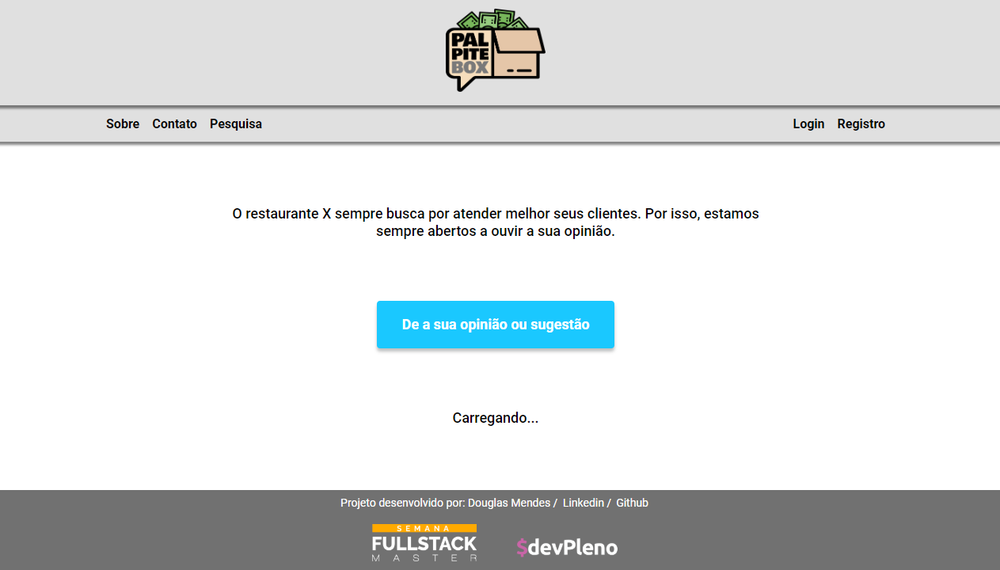

<h1 align="center">
    <a href="https://palpite-box-silk.vercel.app/">
      
    </a>
</h1>

<p align="center">
  <a href="#-tecnologias">Tecnologias</a>&nbsp;&nbsp;&nbsp;|&nbsp;&nbsp;&nbsp;
  <a href="#-projeto">Projeto</a>&nbsp;&nbsp;&nbsp;|&nbsp;&nbsp;&nbsp;
  <a href="#-tecnologias">Como rodar o projeto</a>&nbsp;&nbsp;&nbsp;|&nbsp;&nbsp;&nbsp;
  <a href="#-como-rodar-o-projeto">Como contribuir</a>&nbsp;&nbsp;&nbsp;|&nbsp;&nbsp;&nbsp;
  <a href="#-agradecimentos">Agradecimentos</a>&nbsp;&nbsp;&nbsp;|&nbsp;&nbsp;&nbsp;
  <a href="#-licença">Licença</a>
  
</p>

<p align="center">
 

  

  
</p>

<br>

<p align="center">
  
</p>

## 🚀 Tecnologias

Esse projeto foi desenvolvido com as seguintes tecnologias:

- React
- Axios
- Node.js
- SWR

## 💻 Projeto

**PalpiteBox** - PalpiteBox é um projeto desenvolvido para ajudar em campanhas e pesquisa de market para estabelecimentos comerciais.

## 🚀 Como rodar o projeto

💡Para que o projeto consiga funcionar, precisa-se que o Back End esteja sendo executado.

## Clonando o projeto

Comece realizando um clone deste projeto, se preferir você também pode baixar como um .zip acessando o site do GitHub

```bash
# Clone este repositório
$ git clone https://github.com/capudougmor/PalpiteBox

```

### Rodando a aplicação web (Front End)

```bash
# Vá para a pasta da aplicação Front End
$ cd web

# Instale as dependências
$ npm install
# Ou use Yarn se preferir
$ yarn

# Execute a aplicação em modo de desenvolvimento
$ npm run start
# Ou use Yarn se preferir
$ yarn start

# A aplicação será aberta na porta:3000 - acesse http://localhost:3000
```
## 🤔 Como contribuir

- Faça um fork desse repositório;
- Cria uma branch com a sua feature: `git checkout -b minha-feature`;
- Faça commit das suas alterações: `git commit -m 'feat: Minha nova feature'`;
- Faça push para a sua branch: `git push origin minha-feature`.

Depois que o merge da sua pull request for feito, você pode deletar a sua branch.

## 📝 Licença

Esse projeto está sob a licença MIT. Veja o arquivo [LICENSE](LICENSE.md) para mais detalhes.

---

Produzido por Douglas Mendes

<a href="https://www.linkedin.com/in/douglasmendesassuncao/">
  
</a>

<a href="https://github.com/capudougmor/NextLevelWeek2" style="margin-left: 8px;">
  
</a>
